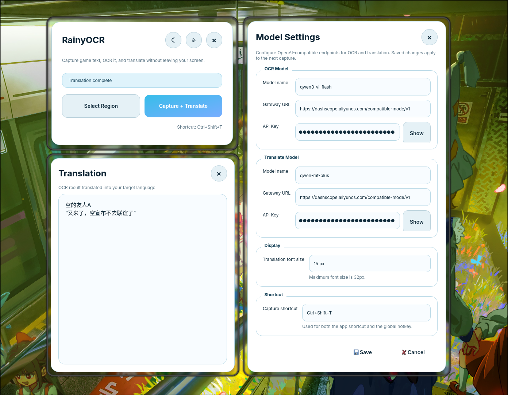

# RainyOCR

<p align="center">
  
</p>

<p align="center">
  <a href="README.md">简体中文</a> · English
</p>

RainyOCR is a low-interruption OCR translation tool. Select a game text region once, then capture, recognize, and translate it into a small independent popup with a button or shortcut. It works well for games with fixed text windows, such as Galgame and RPGMaker titles, and can also help with manga or doujinshi translation.

<p align="center">
  
</p>


## Features

- **Region selection**: select the screen area that should be recognized.
- **Screenshot + OCR + translation**: capture the selected area and call an online model for OCR and translation.
- **Independent translation popup**: translated text appears in a lightweight Translation popup without interrupting the game window.
- **System tray**: when the Translation popup appears, the main window can hide to tray; the tray menu can restore the main window, show the popup, trigger capture again, or quit the app.
- **Shortcut**: default `Ctrl+Shift+T`, configurable in Settings; used for both local and global hotkeys.
- **Model settings**: configure OCR / Translate model names, gateway URLs, and API keys in Settings.
- **Translation font size**: adjust the result font size in Settings, up to 32px.
- **Light / dark themes**: switch themes from the top-right button.
- **Cross-platform compatibility**: Windows is the primary target; Linux screenshot coordinates and macOS window behavior are also handled.

## Tech Stack

| Module | Technology |
| --- | --- |
| Language | Python 3.13+ |
| UI | PySide6 / Qt for Python |
| Dependency management | uv |
| OCR / translation requests | OpenAI-compatible Chat Completions API |
| Global hotkey | pynput |
| Image processing | Pillow |
| Linux screenshot | grim, optional for Wayland |

## Installation

### 1. Clone the repository

```bash
git clone https://github.com/OctoberPrayRain/RainyOCR.git
cd RainyOCR
```

### 2. Install dependencies

Using `uv` is recommended:

```bash
uv sync
```

RainyOCR requires Python `>=3.13`.

### 3. Create local configuration

```bash
cp .env.example .env
```

Then edit `.env` with your model configuration.

> `.env` stores local API keys. Do not commit it to GitHub.

## Configuration

RainyOCR uses OpenAI-compatible APIs, so you can connect it to OpenAI, proxy gateways, or other services compatible with the Chat Completions format.

Main keys in `.env.example`:

For OpenAI-compatible gateways, both a base URL and a full `/chat/completions` URL are accepted. For example, Alibaba Cloud Model Studio / Bailian Beijing can use `https://dashscope.aliyuncs.com/compatible-mode/v1`; RainyOCR will call `/chat/completions` automatically.

| Key | Description |
| --- | --- |
| `OpenAI_OCR_Model_Name` | OCR / multimodal model name |
| `OpenAI_OCR_Secret_Key` | OCR model API key |
| `OpenAI_OCR_Node` | OCR model gateway / base URL, or full `/chat/completions` URL |
| `OpenAI_Translate_Model_Name` | Translation model name |
| `OpenAI_Translate_Secret_Key` | Translation model API key |
| `OpenAI_Translate_Node` | Translation model gateway / base URL, or full `/chat/completions` URL |
| `RainyOCR_Translation_Font_Size` | Translation popup font size, default `15`, max `32` |
| `RainyOCR_Capture_Shortcut` | Capture shortcut, default `Ctrl+Shift+T` |

You can also open **Settings** from the gear button in the top-right corner and configure models, gateways, API keys, shortcuts, and font size there.

## Run

```bash
uv run python main.py
```

If dependencies are already installed manually, you can also run:

```bash
python main.py
```

## Usage

1. Click **Select Region** and select the game text area.
2. Click **Capture + Translate**, or press `Ctrl+Shift+T`.
3. Wait for OCR and translation to finish.
4. Read the result in the **Translation** popup.
5. If the main window hides to tray, use the tray menu to restore the main window, show Translation, translate again, or quit.

## UI Notes

### Main Window

- **Moon / sun button**: switch between light and dark themes.
- **Gear button**: open Settings.
- **X button**: close the main window; if tray is available, it hides to tray first.
- **Select Region**: select a new capture region.
- **Capture + Translate**: immediately capture and translate the selected region.

### Translation Popup

- Shows **Translating...** while running.
- Restores to **Translation** after success.
- Shows **Translation Failed** after failure.
- Translation font size can be adjusted in Settings.
- Windows / Linux use custom frameless draggable windows; macOS falls back to safer native window behavior.

### System Tray

The tray entry is managed by `src/UI/tray.py` and loads this icon by default:

```text
images/rainyocr_tray_icon.svg
```

If the icon cannot be loaded, RainyOCR falls back to the system default icon. The tray menu contains:

- Show Main Window
- Show Translation
- Settings
- Capture + Translate
- Quit RainyOCR

## Platform Notes

### Windows

Windows is the primary target. The main window, Settings window, and Translation popup use custom rounded styling, top-right close buttons, and drag behavior.

### macOS

Qt can be sensitive to transparent frameless windows on macOS, so RainyOCR avoids that risky combination and falls back to native window behavior.

If global shortcuts do not work, check Accessibility / Input Monitoring permissions.

### Linux / Wayland

Install `grim` on Wayland. RainyOCR uses it for screenshots and includes coordinate conversion and edge clipping for Hyprland / high-DPI setups.

## Development Checks

Common checks:

```bash
uv run ruff check src/UI src/OCRAgent src/TranslateAgent
uv run pyright src/UI src/OCRAgent src/TranslateAgent
uv run python -m compileall src/UI src/OCRAgent src/TranslateAgent
```

## Project Structure

```text
RainyOCR/
├── main.py                         # Application entry
├── src/
│   ├── UI/                         # PySide6 UI, windows, tray, settings, capture controller
│   ├── OCRAgent/                   # OCR model calls
│   ├── TranslateAgent/             # Translation model calls
│   └── utils/                      # Environment utilities
├── images/
│   └── rainyocr_tray_icon.svg      # Application tray icon
├── docs/
│   └── design.md                   # Design and implementation notes
├── .env.example                    # Configuration template
├── pyproject.toml                  # Project dependencies
└── uv.lock                         # uv lockfile
```

## License

MIT License. See [LICENSE](LICENSE).
